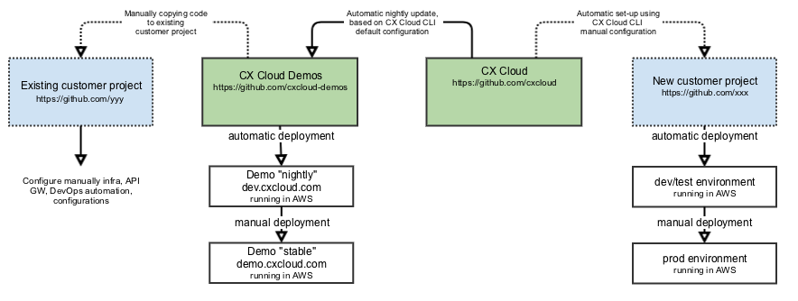

# How to use CX Cloud

CX Cloud is a solution accelerator to create online solutions with microservices & API-first architecture. Example solutions include web shops, customer self-service solutions, content rich web sites and API-layer for mobile apps and other clients. Solution implementation can also be part of "decomposing the monolith" program where your customer targets to create new online solutions with modern omni-channel architecture while at the same time reducing the scope of legacy platforms.

It is good to remember that even if CX Cloud provices accelerators to create an end-to-end online solution including infra, services and front-end's, it is not a ready-made solution. It is more of a framework and its granularity of accelerators enable you to hand pick only the ones you need. For example, you can just use the infra part to get your team up and running in one day and then continue with customizing the rest of the stack.

In high level, there are three main scenarios for usage.

* A green field project to create a new solution or replace existing solution  
* Use CX Cloud for a "decomposing the monolith" program
* Add CX Cloud capablities to an existing microservices stack

## 1. Green field

In this scenario, the solution scope has little dependencies to existing IT stack. You have quite big freedom in technology choises regarding both services, front-ends, infrastrcuture and CI/CD configurations. As target is quite "stand-alone" solution stack, no separate API Gateway is necessarily needed as CX Cloud runs Kubernetes with internal ingress loadbalancer.

For a green field project, you can take a clean start for your project using CX Cloud CLI. Use it to generate infra, services and front-ends needed for your project in hand.

## 2. "Decomposing the monolith"

Quite similar to green field. But there is a need for separate API Gateway to enable multi-vendor approach \(different vendors can expose API's via one gateway\). This gateway can also be utilized to expose API's of current legacy platforms for new client/front-end solutions. CX Cloud enables generating and running AWS API Gateway outside Kubernetes cluster but you can also configure the tool of choice \(e.g. WSO2, Azure API Management\) separately.

In this case, you can have a clean start for your project using CX Cloud CLI and generating the infra, services and front-ends needed.

## 3. Add capabilities for your existing microservice stack

In this scenario, there is already a microservices architecture in place, including centralized API Gateway, version control and DevOps pipeline. Your task might be for example to add additional capabilities \(e.g. commerce, content, search\) to the existing stack. And in this area CX Cloud services might come handy.

In this case, you can copy needed services from [https://github.com/cxcloud-demos](https://github.com/cxcloud-demos) to your own version control and configure DevOps pipeline manually. The repos in our "CX Cloud Demos" GitHub account are created automatically every night by running CX Cloud CLI with default settings.

