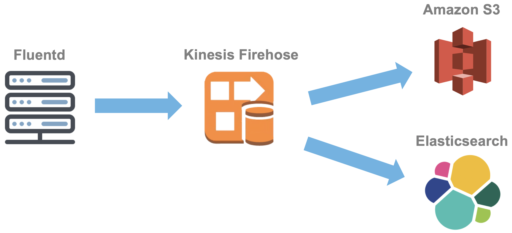

# Configuring Data Engine

The CX Cloud Kubernetes cluster provisioned with kops doesn't come out of the box with centralized logging for the Pods or application. Hence, the data engine 1.0 mostly focus on logging but with a data lake possibility.

## Architecture

The architecture can be seen in the picture below. This version only support at the moment AWS since we use AWS services like Kinesis Firehose.



* Fluentd stream the stdout logs lines to Kinesis Firehose from all Kubernetes pods.
* Kinesis Firehose load the streaming data into Amazon S3 and Amazon Elasticsearch service.
* Amazon S3 store compressed logs that can be used for backups or for further analysis.
* Amazon Elasticsearch service store the logs that can be easily searched with Kibana, which is a part of the managed service from AWS.

### Fluentd

Fluentd should be deployed to the cluster as a deamon set in order to read all pods.

There is a CX Cloud provided [helm chart](https://github.com/cxcloud/helm-fluentd-kinesis-firehose) for installing Fluentd to the Kubernetes cluster.

To get started:

* Install the repository:

```bash
helm repo add cxcloud-fluentd https://raw.githubusercontent.com/cxcloud/helm-fluentd-kinesis-firehose/master
```

* Update repositories:

```bash
helm repo update
```

* Install the chart with version 0.1.0 and the release name `my-fluentd-release` into the namespace `kube-system`:

```bash
helm install cxcloud-fluentd/helm-fluentd-kinesis-firehose \
  --version 0.1.0 \
  --name my-release \
  --namespace kube-system
```

The helm chart is more in detail documented on the GitHub repository, [helm-fluentd-kinesis-firehose](https://github.com/cxcloud/helm-fluentd-kinesis-firehose).

### Kinesis Firehose, S3 and Elasticsearch

The Fluentd daemonset requires that an AWS account has already been provisioned with a Kinesis Firehose stream and with its data stores \(eg. Amazon S3 bucket, Amazon Elasticsearch Service, etc\).

Available is a CX Cloud provided Terraform module, [terraform-kinesis-firehose-elasticsearch](https://github.com/cxcloud/terraform-kinesis-firehose-elasticsearch) for helping with the installation of Kinesis Firehose, Amazon S3 bucket and Amazon Elasticsearch Service.

The following example show how the module can be used in Terraform.

```text
module "kinesis-firehose-elasticsearch" {
  source                       = "github.com/cxcloud/terraform-kinesis-firehose-elasticsearch?ref=v1.1.0"
  region                       = "eu-west-1"
  es_name                      = "cxcloud"
  es_ver                       = 6.5
  es_instance_type             = "t2.small.elasticsearch"
  es_instance_count            = 1
  es_dedicated_master_enabled  = false
  es_ebs_size                  = 35
  es_snapshot_start_hour       = 23
  es_name_tag                  = "CX Cloud"
  es_whitelisted_ips           = ["34.240.135.89/32"]
  stream_name                  = "cxcloud"
  s3_bucket                    = "sandbox-logging"
  s3_buffer_size               = 10
  s3_buffer_interval           = 60
  s3_compression_format        = "GZIP"
  es_index_name                = "cxcloud"
  es_type_name                 = "logs"
  es_buffering_size            = 10
  es_buffering_interval        = 60
  s3_backup_mode               = "AllDocuments"
  whitelisted_aws_account_arns = ["arn:aws:iam::012345678901:root"]
}
```

The Terraform module is more in detail documented on the GitHub repository, [terraform-kinesis-firehose-elasticsearch](https://github.com/cxcloud/terraform-kinesis-firehose-elasticsearch).

