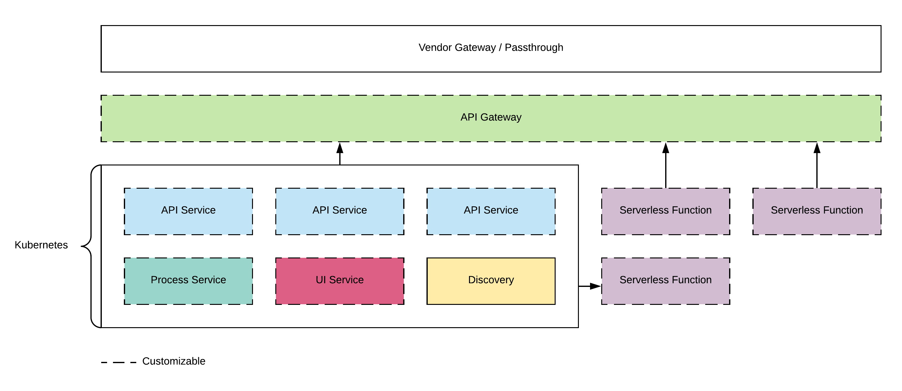

# Architecture Overview

CXCloud projects are essentially services and functions that are deployed to a Kubernetes cluster. There's nothing magical or different about this architecture and the aim of CXCloud is just to make this process as simple and easy to understand as possible.

