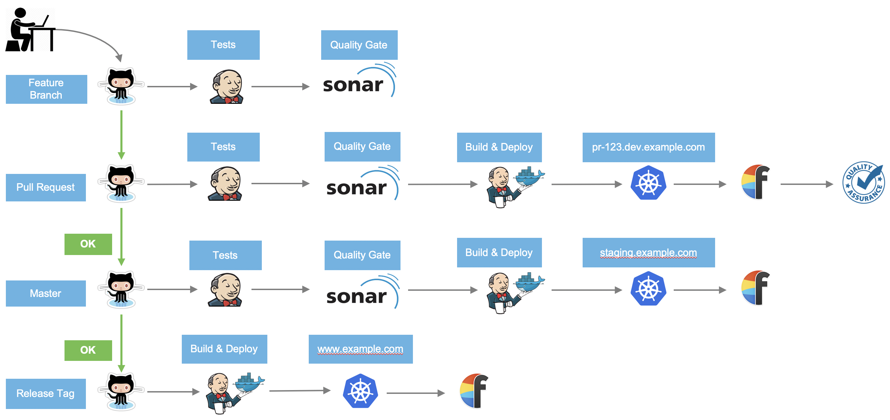
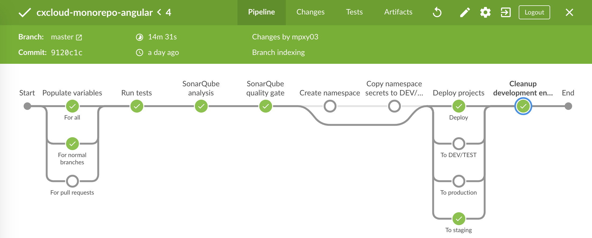

# Configuring CI/CD pipeline

When using CX Cloud CLI, it is fairly easy for one to both create and then deploy CX Cloud infra, selected services and demo frontends to AWS. This is typically enough for testing and exploration needs. We also have [tools and guidelines](../best-practices/how-to-run-infra.md) for DevOps engineer to manually manage your environment. 

But when preparing for customer project development phase, creating a CI/CD pipeline between your Github \(or the Git host of your choice eg. Bitbucket\) and various environments in AWS \(or selected cloud provider eg. Azure\) is the next thing to do. As this area can be very dependent on customer preferences and existing set up, you probably will customize your pipeline. Regardless, we have created this basic set up.

## Development workflow

The CX Cloud CI/CD pipeline has been designed with the following development workflow in mind.



1. A new feature branch is created, the pipeline will checkout the code and run unit tests and perform code quality analysis. This step will be repeated every time a new commit is pushed to the branch..

2. When the feature is ready for review and testing a pull request \(PR\) is created. The pipeline will automatically run tests and code quality analysis. The pipeline will fail in case the tests fails or if the quality analysis doesn't pass the specified quality level. The pipeline will continue with building the micro services and deploy them into a Kubernetes namespace specific for the PR. The pipeline will send notifications to communication channels and publish the web url as a comment to the PR. Now the PR is ready for code review and quality assurance. New commits pushed to the PR will only analyze and deploy the modified projects.

3. When the pull request has passed all steps, it's possible to merge to master. When new code is pushed to master the pipeline will run almost the same steps as for pull requests except this time the pipeline will deploy to the staging environment \(or Kubernetes namespace staging\).

4. The process has been designed so that master is alway deployable to production. To deploy to production a release tag has to be made. The pipeline will automatically recognize all git tags and any of the tags can be with one click in Jenkins build and deployed to production.

### Requirements for the pipeline

- Kubernetes cluster
- Jenkins with preinstalled plugins
- Monorepo architecture of the micro services

### Configure the services for the pipeline

The Pipeline requires that the development strategy uses a monorepo in order to deploy all services. The directory structure for the monorepo should look like:

```console
.
├── packages
|   ├── service 1
|   |   ├── .cxcloud.yaml
|   |   └── ...
|   ├── service 2
|   |   ├── .cxcloud.yaml
|   |   └── ...
|   └── service n
|       ├── .cxcloud.yaml
|       └── ...
├── .cxcloud.yaml
├── Jenkinsfile
└── ...
```

#### Repository root

In the root of the repository should be two files, `Jenkinsfile` and `.cxcloud.yaml`. The pipeline code is in the Jenkinsfile and the `.cxcloud.yaml` file contains the Kubernetes routing for the microservices.

Example of the `.cxcloud.yaml` file in the root of the repository:

```sh
namespace: $GIT_BRANCH
routing:
  domain: $GIT_BRANCH.dev.cxcloud.com
  ingressClass: $INGRESS_CLASS
  lbCert: $LB_CERT
  scheme: $SCHEME
  ssl: false
  rules:
    - path: /graphql
      serviceName: package-graphql-proxy
      servicePort: 80
    - path: /images
      serviceName: package-image-proxy
      servicePort: 80
    - path: /
      serviceName: package-frontend
      servicePort: 80
```

#### Repository services

Every microservice should preferable be in the packages folder but there is no naming convention for the services. Every microservice has to have a `.cxcloud.yaml` in the folder containing the Kuberntes deployments.

Kubernetes secrets should be stored in the namespace they are intended for. However, secrets intended for the PR environments / namespaces should be stored in the applications namespace. The pipeline will copy them from the applications namespace into the specific PR namespace.

Example of the content in the `.cxcloud.yaml` file for a microservice:

```sh
namespace: $GIT_BRANCH
deployment:
  name: $APP_NAME
  image:
    name: $APP_NAME
    repository: $ECR_REPOSITORY
    version: $APP_VERSION
  containerPort: 3000
  port: 80
  replicas: $MIN_REPLICAS
  cpuRequest: $CPU_REQUEST
  nodeSelector:
    kops.k8s.io/instancegroup: $INSTANCE_GROUP
  autoscaling:
    minReplicas: $MIN_REPLICAS
    maxReplicas: $MAX_REPLICAS
    targetAverageUtilization: 75
  env:
    - name: NODE_ENV
      value: production
    - name: CONTENTFUL_MANAGEMENT_API_TOKEN
      valueFrom:
        secretKeyRef:
          name: cxcloud-secret
          key: CONTENTFUL_MANAGEMENT_API_TOKEN
    - name: CONTENTFUL_ENVIRONMENT_ID
      valueFrom:
        secretKeyRef:
          name: cxcloud-secret
          key: CONTENTFUL_ENVIRONMENT_ID
    - name: CONTENTFUL_SPACE_ID
      valueFrom:
        secretKeyRef:
          name: cxcloud-secret
          key: CONTENTFUL_SPACE_ID
```

## Jenkins

The pipeline has been developed for Jenkins. A customized Jenkins image can be build from our [Jenkins repository](https://github.com/cxcloud/jenkins).

The docker image is tailored for Kubernetes and all required plugins will be preinstalled in the Docker image. The Docker pod itself will not run the CI/CD pipeline but a dependency worker will be launched when needed and perform all the steps for the pipeline. The worker will be terminated after the jobs is finished. Several workers can run at the same time as long as the underlying infra can handle the load.

The Jenkins configuration and installation is in detail explained on the [Jenkins repository](https://github.com/cxcloud/jenkins).

## CI/CD Pipeline

A working example of the CI/CD pipeline is in the CX Cloud demo application, [cxcloud-monorepo-angular](https://github.com/cxcloud/demo-cxcloud-monorepo-angular).

### Jenkinsfile structure

The [Jenkinsfile](https://github.com/cxcloud/demo-cxcloud-monorepo-angular/blob/master/Jenkinsfile) structure for the CX Cloud demo explained here is a guideline and should be modified depending on technologies and deployment strategies used. The important part is that the Jenkinsfile should be configured as a multibranch pipeline in Jenkins and that there are different actions specified e.g. for normal branches, pull requests and base branch.

#### Variables

The pipeline starts with defining the variables for all environments, DEV/TEST (pull requests), staging (base branch, master) and production (git tag).

The first stage in the pipeline, `populate variables` will set the values for many of the variables that has to be calculated while the pipeline is running. E.g. some values for pull requests can only be populated in case the job execution is an actual pull request.

#### Code Quality

The following stage, `run tests` will run the tests. The pipeline will stop in case any of the tests fails. When we work in a branch all tests will run for all projects. However, when a pull requests is created, only tests for modified projects will be executed. When deploying a release tag, none of the tests will run, since all tests had already to pass previously in the base branch.

Stage `SonarQube analysis` will run sonar-scanner and analyse the projects on SonarQube. The pipeline will not check at this stage if the code quality for the projects pass or fail.

Stage `SonarQube quality gate` ensure that all the projects has passed the SonarQube analysis. The pipeline will fail and send notifications in case any of the projects doesn't pass the "quality gate".

#### Create Kubernetes namespace

The pipeline will deploy all of the services into a new dev/test environment or to the staging or production environment. Stage `Create namespace` will create a new kubernetes namespace for the deployment in case it doesn't already exist.

#### Copy namespace secrets

The CX Cloud demo uses the namespace `applications` for storing secrets for the test/dev environments. Stage `Copy namespace secrets to DEV/TEST environment` will copy the secrets from the application namespace into the test/dev environments.

Secrets will only be copied for pull requests. Secrets for other environments (staging and production) has to be created independently of the pipeline.

#### Deploy projects

Stage `Deploy projects` will use the cxcloud command line tool, [cxcloud-cli](https://github.com/cxcloud/cxcloud-cli) to deploy the projects. The command will create docker images, upload them to a private docker registry and deploy the new services into the Kubernetes cluster.

The pipeline will take care of only deploying modified projects unless it's to a new namespace. Also deployments to staging and production will deploy all of the services.

#### Clean up test environments

It is vital to delete old environment since every pull request will create a new dev/test environment. Stage `Cleanup development environments` will delete all dev/test environment for pull requests that has been closed. This stage will only be executed in case any new code will be pushed to the base branch, master.

#### Post actions

The post actions will always run in the end of job. The pipeline for the CX Cloud demo will always notify Flowdock if the execution succeeded or failed. The notification will contain details about the url to the running environment, GitHub url, Jenkins execution url and git commit messages.

The post section can easily be modified to send notifications to other destinations like Slack.

In case the job fails, the post action will delete the namespace if it was created during the same execution.

### Example

Below is a Jenkins screenshot of a deployment to staging for the [CX Cloud demo application](https://github.com/cxcloud/demo-cxcloud-monorepo-angular).


